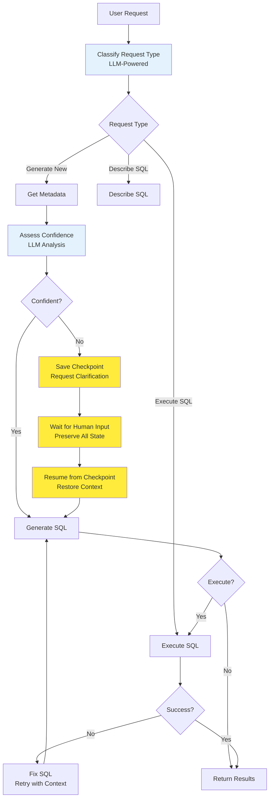

# LlamaIndex RAG Text-to-SQL System

A comprehensive text-to-SQL system using LlamaIndex for Retrieval-Augmented Generation (RAG), OpenSearch for vector storage, LangGraph for agent workflows, and AWS Bedrock for LLM/embedding services. The system features **hierarchical metadata architecture** for efficient context retrieval, human-in-the-loop capabilities, confidence assessment, and adaptive workflow routing.

## 🚀 Features

### Core Capabilities
- **Natural Language to SQL**: Convert natural language queries to SQL using RAG-enhanced context
- **🆕 Hierarchical Metadata Architecture**: Multi-tiered context retrieval (DDL → Business Descriptions → Rules → Column Details) with 80-90% token reduction
- **🚀 High-Performance Retrieval**: Response times improved from 40s to 5-10s with intelligent context selection
- **Enhanced Human-in-the-Loop (HITL)**: Intelligent clarification requests with complete state preservation
- **Stateful Workflow Resumption**: Resume interrupted workflows exactly where they left off
- **Confidence Assessment**: Automatic evaluation of metadata completeness with LLM-powered classification
- **Adaptive Workflow Routing**: Intelligent routing based on LLM-powered request type classification
- **Advanced Conversation Management**: Multi-turn conversations with separation of conversation threads and individual request fulfillment
- **Document Management**: MongoDB integration with vector store synchronization

### Technical Features
- **🆕 HierarchicalContextService**: Progressive metadata enhancement with smart table selection and token-aware context building
- **LangGraph Agent**: Sophisticated workflow orchestration with checkpoint-based state persistence (streamlined for hierarchical architecture)
- **Workflow State Serialization**: Complete preservation of intermediate workflow data for HITL scenarios
- **Dual ID System**: Separate conversation IDs (thread tracking) and request IDs (individual fulfillment)
- **Vector Search**: Hybrid retrieval using OpenSearch vector store with 5 document types (DDL, Business Descriptions, Business Rules, Column Details, Lookups)
- **Multiple LLM Providers**: Seamless switching between AWS Bedrock and custom LLM APIs
- **Endpoint-Based Integration**: Secure Bedrock access via HTTP endpoint (no direct AWS credentials required)
- **Document Processing**: Specialized chunking for each metadata tier with optimized content formats
- **Error Recovery**: Intelligent retry mechanisms with context injection
- **RESTful API**: Comprehensive API endpoints with FastAPI and enhanced conversation management

## 🏗️ Hierarchical Metadata Architecture

The system uses a revolutionary **5-tier metadata architecture** that dramatically improves performance and accuracy:

### Document Types & Organization
```
meta_documents/catalog_name/
├── schema/ddl/              # Tier 1: Core DDL (always retrieved)
│   ├── trade.sql           # CREATE TABLE statements with descriptions
│   └── users.sql
├── descriptions/            # Tier 2: Business context (for table selection)
│   ├── trading_lifecycle.json
│   └── user_management.json
├── business_rules/          # Tier 3: Special handling rules (conditional)
│   └── date_and_status_rules.json
├── columns/                 # Tier 4: Detailed column info (complex queries only)
│   ├── trade.json
│   └── users.json
└── lookups/                 # Cross-cutting: ID-name mappings
    └── tranche_status_lookups.json
```

### Performance Benefits
- **Token Reduction**: 80-90% decrease (20K+ → 2-5K tokens)
- **Response Time**: 75-87% improvement (40s → 5-10s)
- **Context Quality**: Higher accuracy through targeted retrieval
- **Scalability**: Linear performance as schema grows

### Retrieval Strategy
1. **Smart Table Selection**: LLM analyzes business descriptions to identify 3-7 relevant tables
2. **Progressive Enhancement**: Adds DDL → Lookups → Rules → Column Details as needed
3. **Token-Aware Building**: Respects context limits while maximizing relevance
4. **Conditional Tiers**: Advanced rules only included for complex queries or retries

## 📋 Requirements

### System Requirements
- Python 3.9+
- Docker (for MongoDB and OpenSearch)
- AWS Account (for Bedrock services)

### Dependencies
See `pyproject.toml` for complete dependency list. Key dependencies:
- `fastapi` - Web framework
- `llama-index` - RAG framework
- `langgraph` - Agent workflow orchestration
- `opensearch-py` - OpenSearch client
- `pymongo` - MongoDB driver
- `boto3` - AWS SDK
- `pydantic` - Data validation
- `structlog` - Structured logging

## 🛠️ Installation

### 1. Clone Repository
```bash
git clone <repository-url>
cd llamaindex_rag
```

### 2. Install Dependencies
```bash
# Using Poetry (recommended)
poetry install

# Or using pip
pip install -e .
```

### 3. Environment Configuration

The system supports multiple deployment configurations. Choose the appropriate configuration for your environment:

#### Development with Bedrock Endpoint (Recommended)
Copy `.env.bedrock_endpoint.example` to `.env` for endpoint-based development:

```env
# Application Configuration
APP_DEBUG=true
SECRET_KEY=your-local-secret-key-here
LLM_PROVIDER=bedrock_endpoint

# Bedrock Endpoint Configuration
BEDROCK_ENDPOINT_URL=https://your-bedrock-endpoint.com
AWS_LLM_MODEL=us.anthropic.claude-3-haiku-20240307-v1:0
AWS_EMBEDDING_MODEL=amazon.titan-embed-text-v1

# OpenSearch Configuration
OPENSEARCH_HOST=localhost
OPENSEARCH_PORT=9200
OPENSEARCH_USERNAME=admin
OPENSEARCH_PASSWORD=admin
OPENSEARCH_USE_SSL=false
OPENSEARCH_VERIFY_CERTS=false
OPENSEARCH_INDEX_NAME=documents
OPENSEARCH_VECTOR_FIELD=vector
OPENSEARCH_VECTOR_SIZE=1536

# Local Services
MONGODB_URL=mongodb://localhost:27017
```

#### Custom LLM Provider Configuration
Copy `.env.custom-llm.example` to `.env` for custom LLM API:

```env
# LLM Provider Configuration
LLM_PROVIDER=custom

# Custom LLM Configuration
CUSTOM_LLM_BASE_URL=https://your-internal-llm-api.com
CUSTOM_LLM_DEPLOYMENT_ID=your-deployment-id
CUSTOM_LLM_MODEL_NAME=your-preferred-model
CUSTOM_LLM_TIMEOUT=30

# OpenSearch for vectors with Bedrock endpoint for embeddings
OPENSEARCH_HOST=localhost
BEDROCK_ENDPOINT_URL=https://your-bedrock-endpoint.com
AWS_EMBEDDING_MODEL=amazon.titan-embed-text-v1
```

#### Production Configuration
Copy `.env.bedrock_endpoint.example` to `.env` for production deployment:

```env
# Production settings with endpoint access
LLM_PROVIDER=bedrock_endpoint
BEDROCK_ENDPOINT_URL=https://your-production-bedrock-endpoint.com
AWS_LLM_MODEL=us.anthropic.claude-3-haiku-20240307-v1:0
AWS_EMBEDDING_MODEL=amazon.titan-embed-text-v1
```

### 4. Start Infrastructure Services
```bash
# Start MongoDB and OpenSearch using Docker
docker run -d --name mongodb -p 27017:27017 mongo:latest
docker run -d --name opensearch \
  -p 9200:9200 -p 9600:9600 \
  -e "discovery.type=single-node" \
  -e "OPENSEARCH_INITIAL_ADMIN_PASSWORD=admin" \
  opensearchproject/opensearch:latest
```

### 5. Test Your Configuration
```bash
# Test your local setup before starting the application
python test_local_setup.py

# This will validate:
# - Environment variables are loaded correctly
# - Settings configuration is valid
# - LLM provider is accessible
# - Vector store connection works
# - MongoDB connection (if running)
# - Application startup process
```

### 6. Initialize Application
```bash
# Run startup tasks to initialize services and sync documents
python -m src.text_to_sql_rag.core.startup
```

## 🚀 Usage

### Starting the API Server
```bash
# Development mode
python -m src.text_to_sql_rag.api.main

# Production mode with Uvicorn
uvicorn src.text_to_sql_rag.api.main:app --host 0.0.0.0 --port 8000
```

### API Endpoints

#### Text-to-SQL Generation
```bash
# Basic SQL generation
curl -X POST "http://localhost:8000/query/generate" \
  -H "Content-Type: application/json" \
  -d '{"query": "Show me all users who registered last month"}'

# Start conversation with enhanced HITL support
curl -X POST "http://localhost:8000/conversations/start" \
  -H "Content-Type: application/json" \
  -d '{"query": "What are the sales trends?", "context": {"user_id": "user123"}}'

# Continue conversation (automatically detects clarification vs new request)
curl -X POST "http://localhost:8000/conversations/{id}/continue" \
  -H "Content-Type: application/json" \
  -d '{"message": "I mean sales by product category for Q4 2023"}'

# Check conversation status and pending clarifications
curl -X GET "http://localhost:8000/conversations/{id}/status"
```

#### Document Management
```bash
# Upload document
curl -X POST "http://localhost:8000/documents/upload" \
  -F "file=@schema.json" \
  -F "title=Database Schema" \
  -F "document_type=schema"

# Search documents
curl -X POST "http://localhost:8000/search/documents" \
  -H "Content-Type: application/json" \
  -d '{"query": "user table", "limit": 5}'
```

#### LLM Provider Management
```bash
# Get current provider information
curl -X GET "http://localhost:8000/llm-provider/info"

# Switch to custom LLM provider
curl -X POST "http://localhost:8000/llm-provider/switch" \
  -H "Content-Type: application/json" \
  -d '{"provider": "custom"}'

# Switch back to Bedrock
curl -X POST "http://localhost:8000/llm-provider/switch" \
  -H "Content-Type: application/json" \
  -d '{"provider": "bedrock"}'

# Test current provider
curl -X GET "http://localhost:8000/llm-provider/test"
```

### Document Structure

Place metadata documents in the `meta_documents/` directory:

```
meta_documents/
├── catalog_name/
│   ├── schema/
│   │   └── schema_metadata.json
│   └── reports/
│       └── example_report.txt
```

#### Schema Document Format (JSON)
```json
{
  "catalog": "ecommerce",
  "schema": "public",
  "models": [
    {
      "table_name": "users",
      "columns": [
        {
          "name": "id",
          "type": "INTEGER",
          "key": "PRIMARY KEY"
        },
        {
          "name": "email",
          "type": "VARCHAR(255)",
          "nullable": false
        }
      ]
    }
  ]
}
```

#### Report Document Format (Text)
```text
Monthly Sales Report

Description:
This report shows monthly sales aggregated by product category.

Data Returned:
Product category, month, total sales amount, order count

SQL Query:
SELECT 
    p.category,
    DATE_TRUNC('month', o.created_at) as month,
    SUM(oi.price * oi.quantity) as total_sales,
    COUNT(DISTINCT o.id) as order_count
FROM orders o
JOIN order_items oi ON o.id = oi.order_id
JOIN products p ON oi.product_id = p.id
GROUP BY p.category, DATE_TRUNC('month', o.created_at)
ORDER BY month DESC, total_sales DESC;

Use Cases:
- Monthly business reviews
- Category performance analysis
- Trend identification
```

## 🏗️ Architecture

### Core Components

1. **LangGraph Agent** (`core/langgraph_agent.py`)
   - Orchestrates the entire text-to-SQL workflow
   - Implements HITL capabilities and confidence assessment
   - Handles conversation state and context management

2. **Vector Service** (`services/vector_service.py`)
   - Manages document indexing and retrieval  
   - Integrates LlamaIndex with OpenSearch
   - Handles hybrid search and document preprocessing

3. **MongoDB Service** (`services/mongodb_service.py`)
   - Document metadata storage and management
   - Change detection and synchronization
   - Connection handling and health monitoring

4. **Document Sync Service** (`services/document_sync_service.py`)
   - Synchronizes between filesystem, MongoDB, and vector store
   - Processes documents from meta_documents directory
   - Handles document parsing and validation

5. **Bedrock Endpoint Service** (`services/bedrock_endpoint_service.py`)
   - HTTP endpoint integration for AWS Bedrock models
   - Supports multiple model families (Claude, Titan, Llama)
   - Secure endpoint-based authentication
   - Error handling and embedding fallback mechanisms

6. **Custom LLM Service** (`services/custom_llm_service.py`)
   - Integration with internal LLM APIs
   - Support for custom deployment endpoints
   - Conversation management and follow-up handling

7. **LLM Provider Factory** (`services/llm_provider_factory.py`)
   - Seamless switching between LLM providers
   - Unified interface for all provider types
   - Health monitoring and provider information

### Enhanced Workflow Process with HITL State Management



#### Key HITL Enhancements:
- **Checkpoint-Based State Persistence**: Complete workflow state saved before clarification
- **Intelligent Resumption**: Exact restoration of schema context, confidence scores, and metadata
- **Dual ID System**: Conversation threads (conversation_id) separate from request fulfillment (request_id)
- **LLM-Powered Classification**: Advanced request type detection with reasoning
- **Context Preservation**: All intermediate data maintained across human interactions

## 🔄 Human-in-the-Loop (HITL) State Management

### Overview
The enhanced HITL system ensures complete workflow state persistence during clarification requests, enabling seamless resumption of complex SQL generation workflows.

### Key Components

#### 1. Dual ID System
- **Conversation ID**: Tracks entire conversation threads with multiple exchanges
- **Request ID**: Tracks individual request fulfillment within conversations
- **Session ID**: Optional user session tracking for analytics

#### 2. Workflow State Serialization
```python
# Automatic state preservation before clarification
checkpoint_data = {
    "conversation_id": "conv_123",
    "request_id": "req_456", 
    "workflow_state": {
        "schema_context": [...],      # Retrieved database schema
        "example_context": [...],     # Retrieved example queries
        "confidence_score": 0.65,     # LLM confidence assessment
        "sources": [...],             # Document sources used
        "intermediate_data": {...}    # Any workflow-specific data
    },
    "current_request": "Show me sales data",
    "request_type": "GENERATE_NEW"
}
```

#### 3. Workflow Resumption Process
1. **Save Checkpoint**: When clarification is needed, complete workflow state is serialized
2. **Wait for Human**: System returns clarification request to user, maintains state
3. **Restore Context**: Upon user response, exact workflow state is restored
4. **Continue Processing**: Workflow resumes with full context preserved

### API Usage Examples

#### Starting a Conversation
```bash
curl -X POST "http://localhost:8000/conversations/start" \
  -H "Content-Type: application/json" \
  -d '{
    "query": "Show me user activity",
    "context": {"user_id": "analyst_1", "department": "sales"}
  }'

# Response includes conversation_id and request_id
{
  "conversation_id": "conv_abc123",
  "result": {
    "response_type": "clarification_request",
    "request_id": "req_def456",
    "clarification": {
      "message": "I need clarification about which user activity data you're looking for...",
      "suggestions": [...]
    },
    "checkpoint_saved": true
  }
}
```

#### Continuing with Clarification
```bash
curl -X POST "http://localhost:8000/conversations/conv_abc123/continue" \
  -H "Content-Type: application/json" \
  -d '{"message": "I want login activity for the past week"}'

# System automatically:
# 1. Detects pending clarification for req_def456
# 2. Restores complete workflow state from checkpoint
# 3. Continues processing with full context
```

#### Monitoring Conversation Status
```bash
curl -X GET "http://localhost:8000/conversations/conv_abc123/status"

# Response shows conversation state
{
  "conversation_id": "conv_abc123",
  "status": "waiting_for_clarification",
  "total_requests": 1,
  "completed_requests": 0,
  "has_pending_clarification": true,
  "pending_request_id": "req_def456"
}
```

### Benefits

1. **No Lost Context**: Schema context, confidence assessments, and retrieved documents are preserved
2. **Seamless Experience**: Users can provide clarification at any time without starting over
3. **Intelligent Routing**: System distinguishes between clarification responses and new requests
4. **Scalable Architecture**: Checkpoint storage can be easily replaced with Redis/database for production

## 🔧 Configuration

### Settings Structure
The application uses Pydantic settings with environment variable support:

- `AppSettings`: General application configuration
- `BedrockEndpointSettings`: Bedrock endpoint service configuration
- `OpenSearchSettings`: Vector database configuration
- `MongoDBSettings`: Document storage configuration
- `SecuritySettings`: Authentication and security

### Key Configuration Options

| Setting | Environment Variable | Default | Description |
|---------|---------------------|---------|-------------|
| `debug` | `APP_DEBUG` | `False` | Enable debug mode |
| `chunk_size` | `APP_CHUNK_SIZE` | `1000` | Text chunking size |
| `similarity_top_k` | `APP_SIMILARITY_TOP_K` | `5` | Number of similar docs to retrieve |
| `confidence_threshold` | `APP_CONFIDENCE_THRESHOLD` | `0.7` | Threshold for HITL triggering |

## 🧪 Testing

### Running Tests
```bash
# Run all tests
python -m pytest tests/

# Run with coverage
python -m pytest tests/ --cov=src --cov-report=html

# Run specific test categories
python -m pytest tests/unit/
python -m pytest tests/integration/
```

### Health Checks
```bash
# Basic health check
curl http://localhost:8000/health

# Detailed health check
curl http://localhost:8000/health/detailed

# Application statistics
curl http://localhost:8000/stats
```

## 📊 Monitoring

### Structured Logging
The application uses `structlog` for structured logging:

```python
import structlog
logger = structlog.get_logger(__name__)
logger.info("SQL generation started", query_length=len(query), confidence=0.85)
```

### Health Monitoring
- Service health endpoints for all components
- MongoDB connection status
- Vector store health
- Document synchronization status

## 🔒 Security

### Security Features
- No default secret keys (must be set via environment)
- Configurable CORS policy
- Input validation using Pydantic models
- Structured error handling without information leakage

### Production Considerations
- Set strong `SECRET_KEY` environment variable
- Configure appropriate CORS origins
- Use HTTPS in production
- Implement rate limiting
- Monitor for suspicious queries

## 📈 Performance

### Optimization Features
- Hybrid vector search combining semantic and keyword matching
- Document chunking for optimal retrieval
- Connection pooling for database operations
- Caching for frequently accessed metadata

### Scaling Considerations
- Replace in-memory session storage with Redis
- Implement database connection pooling
- Add horizontal scaling for API servers
- Consider vector database sharding for large datasets

## 🐛 Troubleshooting

### Common Issues

1. **Import Errors**
   - Ensure all dependencies are installed
   - Check Python version compatibility (3.9+)

2. **AWS Bedrock Access**
   - Verify AWS credentials and permissions
   - Check model availability in your region
   - Ensure Bedrock service is enabled

3. **Vector Store Connection**
   - Verify OpenSearch is running and accessible
   - Check index configuration
   - Validate vector dimensions match embedding model

4. **MongoDB Connection**
   - Ensure MongoDB is running
   - Check connection string format
   - Verify database permissions

### Debugging
Enable debug mode for detailed logging:
```env
APP_DEBUG=true
```

Check service health:
```bash
curl http://localhost:8000/health/detailed
```

## 🤝 Contributing

### Development Setup
1. Fork the repository
2. Create a feature branch
3. Install development dependencies: `poetry install --with dev`
4. Make changes with appropriate tests
5. Run tests and linting
6. Submit a pull request

### Code Standards
- Follow PEP 8 style guidelines
- Use type hints for all functions
- Write comprehensive docstrings
- Maintain test coverage above 80%
- Use structured logging

## 📜 License

[Add your license information here]

## 🆘 Support

For support and questions:
- Check the troubleshooting section
- Review health check endpoints
- Examine application logs
- Create an issue on GitHub

---

*This README provides a comprehensive overview of the LlamaIndex RAG Text-to-SQL system. For detailed API documentation, see the `/docs` endpoint when the server is running.*