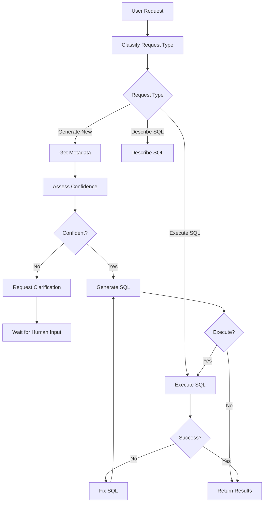

# LlamaIndex RAG Text-to-SQL System

A comprehensive text-to-SQL system using LlamaIndex for Retrieval-Augmented Generation (RAG), LangGraph for agent workflows, and AWS Bedrock for LLM/embedding services. The system features human-in-the-loop capabilities, confidence assessment, and adaptive workflow routing.

## 🚀 Features

### Core Capabilities
- **Natural Language to SQL**: Convert natural language queries to SQL using RAG-enhanced context
- **Human-in-the-Loop (HITL)**: Intelligent clarification requests when confidence is low
- **Confidence Assessment**: Automatic evaluation of metadata completeness
- **Adaptive Workflow Routing**: Intelligent routing based on request type classification
- **Conversation Management**: Multi-turn conversations with context preservation
- **Document Management**: MongoDB integration with vector store synchronization

### Technical Features
- **LangGraph Agent**: Sophisticated workflow orchestration with retry logic
- **Vector Search**: Hybrid retrieval using Qdrant vector store
- **AWS Bedrock Integration**: Support for Claude, Titan, and Llama models
- **Document Processing**: JSON to Dolphin format conversion for better vectorization
- **Error Recovery**: Intelligent retry mechanisms with context injection
- **RESTful API**: Comprehensive API endpoints with FastAPI

## 📋 Requirements

### System Requirements
- Python 3.9+
- Docker (for MongoDB and Qdrant)
- AWS Account (for Bedrock services)

### Dependencies
See `pyproject.toml` for complete dependency list. Key dependencies:
- `fastapi` - Web framework
- `llama-index` - RAG framework
- `langgraph` - Agent workflow orchestration
- `qdrant-client` - Vector database client
- `pymongo` - MongoDB driver
- `boto3` - AWS SDK
- `pydantic` - Data validation
- `structlog` - Structured logging

## 🛠️ Installation

### 1. Clone Repository
```bash
git clone <repository-url>
cd llamaindex_rag
```

### 2. Install Dependencies
```bash
# Using Poetry (recommended)
poetry install

# Or using pip
pip install -e .
```

### 3. Environment Configuration
Create a `.env` file with required environment variables:

```env
# AWS Bedrock Configuration
AWS_REGION=us-east-1
AWS_ACCESS_KEY_ID=your_access_key
AWS_SECRET_ACCESS_KEY=your_secret_key
AWS_SESSION_TOKEN=your_session_token  # Optional
AWS_LLM_MODEL=anthropic.claude-3-sonnet-20240229-v1:0
AWS_EMBEDDING_MODEL=amazon.titan-embed-text-v1

# Qdrant Configuration
QDRANT_HOST=localhost
QDRANT_PORT=6333
QDRANT_COLLECTION_NAME=documents
QDRANT_VECTOR_SIZE=1536

# MongoDB Configuration
MONGODB_URL=mongodb://localhost:27017
MONGODB_DATABASE=text_to_sql_rag

# Security Configuration
SECRET_KEY=your-very-secure-secret-key-here

# Application Configuration
APP_DEBUG=false
APP_TITLE="Text-to-SQL RAG System"
APP_VERSION="1.0.0"
```

### 4. Start Infrastructure Services
```bash
# Start MongoDB and Qdrant using Docker
docker run -d --name mongodb -p 27017:27017 mongo:latest
docker run -d --name qdrant -p 6333:6333 qdrant/qdrant:latest
```

### 5. Initialize Application
```bash
# Run startup tasks to initialize services and sync documents
python -m src.text_to_sql_rag.core.startup
```

## 🚀 Usage

### Starting the API Server
```bash
# Development mode
python -m src.text_to_sql_rag.api.main

# Production mode with Uvicorn
uvicorn src.text_to_sql_rag.api.main:app --host 0.0.0.0 --port 8000
```

### API Endpoints

#### Text-to-SQL Generation
```bash
# Basic SQL generation
curl -X POST "http://localhost:8000/query/generate" \
  -H "Content-Type: application/json" \
  -d '{"query": "Show me all users who registered last month"}'

# Start conversation with HITL support
curl -X POST "http://localhost:8000/conversations/start" \
  -H "Content-Type: application/json" \
  -d '{"query": "What are the sales trends?"}'

# Continue conversation with clarification
curl -X POST "http://localhost:8000/conversations/{id}/continue" \
  -H "Content-Type: application/json" \
  -d '{"message": "I mean sales by product category for Q4 2023"}'
```

#### Document Management
```bash
# Upload document
curl -X POST "http://localhost:8000/documents/upload" \
  -F "file=@schema.json" \
  -F "title=Database Schema" \
  -F "document_type=schema"

# Search documents
curl -X POST "http://localhost:8000/search/documents" \
  -H "Content-Type: application/json" \
  -d '{"query": "user table", "limit": 5}'
```

### Document Structure

Place metadata documents in the `meta_documents/` directory:

```
meta_documents/
├── catalog_name/
│   ├── schema/
│   │   └── schema_metadata.json
│   └── reports/
│       └── example_report.txt
```

#### Schema Document Format (JSON)
```json
{
  "catalog": "ecommerce",
  "schema": "public",
  "models": [
    {
      "table_name": "users",
      "columns": [
        {
          "name": "id",
          "type": "INTEGER",
          "key": "PRIMARY KEY"
        },
        {
          "name": "email",
          "type": "VARCHAR(255)",
          "nullable": false
        }
      ]
    }
  ]
}
```

#### Report Document Format (Text)
```text
Monthly Sales Report

Description:
This report shows monthly sales aggregated by product category.

Data Returned:
Product category, month, total sales amount, order count

SQL Query:
SELECT 
    p.category,
    DATE_TRUNC('month', o.created_at) as month,
    SUM(oi.price * oi.quantity) as total_sales,
    COUNT(DISTINCT o.id) as order_count
FROM orders o
JOIN order_items oi ON o.id = oi.order_id
JOIN products p ON oi.product_id = p.id
GROUP BY p.category, DATE_TRUNC('month', o.created_at)
ORDER BY month DESC, total_sales DESC;

Use Cases:
- Monthly business reviews
- Category performance analysis
- Trend identification
```

## 🏗️ Architecture

### Core Components

1. **LangGraph Agent** (`core/langgraph_agent.py`)
   - Orchestrates the entire text-to-SQL workflow
   - Implements HITL capabilities and confidence assessment
   - Handles conversation state and context management

2. **Vector Service** (`services/vector_service.py`)
   - Manages document indexing and retrieval
   - Integrates LlamaIndex with Qdrant
   - Handles hybrid search and document preprocessing

3. **MongoDB Service** (`services/mongodb_service.py`)
   - Document metadata storage and management
   - Change detection and synchronization
   - Connection handling and health monitoring

4. **Document Sync Service** (`services/document_sync_service.py`)
   - Synchronizes between filesystem, MongoDB, and vector store
   - Processes documents from meta_documents directory
   - Handles document parsing and validation

5. **Bedrock Service** (`services/bedrock_service.py`)
   - AWS Bedrock integration for LLMs and embeddings
   - Supports multiple model families (Claude, Titan, Llama)
   - Error handling and fallback mechanisms

### Workflow Process



## 🔧 Configuration

### Settings Structure
The application uses Pydantic settings with environment variable support:

- `AppSettings`: General application configuration
- `AWSSettings`: Bedrock service configuration
- `QdrantSettings`: Vector database configuration
- `MongoDBSettings`: Document storage configuration
- `SecuritySettings`: Authentication and security

### Key Configuration Options

| Setting | Environment Variable | Default | Description |
|---------|---------------------|---------|-------------|
| `debug` | `APP_DEBUG` | `False` | Enable debug mode |
| `chunk_size` | `APP_CHUNK_SIZE` | `1000` | Text chunking size |
| `similarity_top_k` | `APP_SIMILARITY_TOP_K` | `5` | Number of similar docs to retrieve |
| `confidence_threshold` | `APP_CONFIDENCE_THRESHOLD` | `0.7` | Threshold for HITL triggering |

## 🧪 Testing

### Running Tests
```bash
# Run all tests
python -m pytest tests/

# Run with coverage
python -m pytest tests/ --cov=src --cov-report=html

# Run specific test categories
python -m pytest tests/unit/
python -m pytest tests/integration/
```

### Health Checks
```bash
# Basic health check
curl http://localhost:8000/health

# Detailed health check
curl http://localhost:8000/health/detailed

# Application statistics
curl http://localhost:8000/stats
```

## 📊 Monitoring

### Structured Logging
The application uses `structlog` for structured logging:

```python
import structlog
logger = structlog.get_logger(__name__)
logger.info("SQL generation started", query_length=len(query), confidence=0.85)
```

### Health Monitoring
- Service health endpoints for all components
- MongoDB connection status
- Vector store health
- Document synchronization status

## 🔒 Security

### Security Features
- No default secret keys (must be set via environment)
- Configurable CORS policy
- Input validation using Pydantic models
- Structured error handling without information leakage

### Production Considerations
- Set strong `SECRET_KEY` environment variable
- Configure appropriate CORS origins
- Use HTTPS in production
- Implement rate limiting
- Monitor for suspicious queries

## 📈 Performance

### Optimization Features
- Hybrid vector search combining semantic and keyword matching
- Document chunking for optimal retrieval
- Connection pooling for database operations
- Caching for frequently accessed metadata

### Scaling Considerations
- Replace in-memory session storage with Redis
- Implement database connection pooling
- Add horizontal scaling for API servers
- Consider vector database sharding for large datasets

## 🐛 Troubleshooting

### Common Issues

1. **Import Errors**
   - Ensure all dependencies are installed
   - Check Python version compatibility (3.9+)

2. **AWS Bedrock Access**
   - Verify AWS credentials and permissions
   - Check model availability in your region
   - Ensure Bedrock service is enabled

3. **Vector Store Connection**
   - Verify Qdrant is running and accessible
   - Check collection configuration
   - Validate vector dimensions match embedding model

4. **MongoDB Connection**
   - Ensure MongoDB is running
   - Check connection string format
   - Verify database permissions

### Debugging
Enable debug mode for detailed logging:
```env
APP_DEBUG=true
```

Check service health:
```bash
curl http://localhost:8000/health/detailed
```

## 🤝 Contributing

### Development Setup
1. Fork the repository
2. Create a feature branch
3. Install development dependencies: `poetry install --with dev`
4. Make changes with appropriate tests
5. Run tests and linting
6. Submit a pull request

### Code Standards
- Follow PEP 8 style guidelines
- Use type hints for all functions
- Write comprehensive docstrings
- Maintain test coverage above 80%
- Use structured logging

## 📜 License

[Add your license information here]

## 🆘 Support

For support and questions:
- Check the troubleshooting section
- Review health check endpoints
- Examine application logs
- Create an issue on GitHub

---

*This README provides a comprehensive overview of the LlamaIndex RAG Text-to-SQL system. For detailed API documentation, see the `/docs` endpoint when the server is running.*